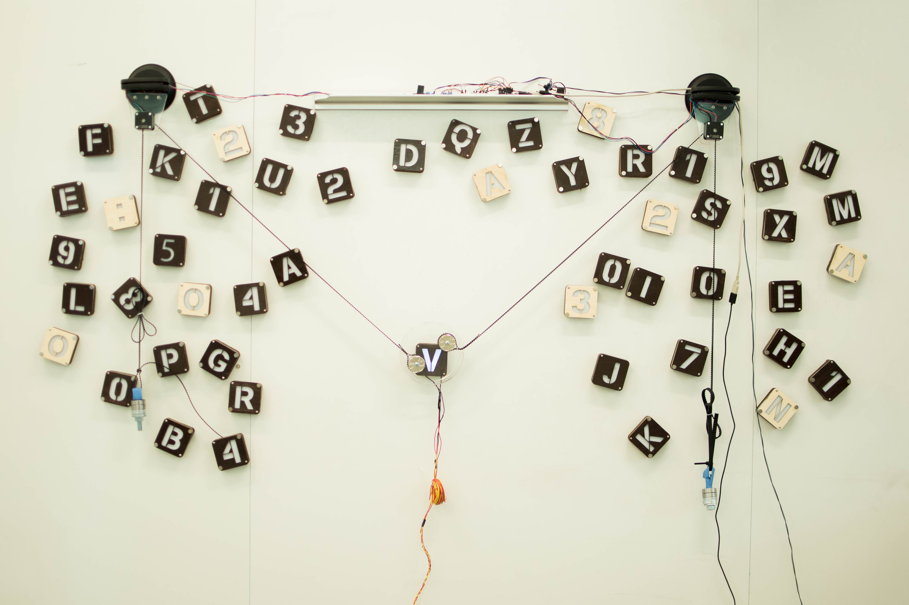

# alphabet-board
code for Alphabet Board project, for CS194-28 at UC Berkeley

## files
- `project.ino` is for the Arduino Uno R3
- `serialinput.py` is for taking keyboard input and sending data to the arduino
